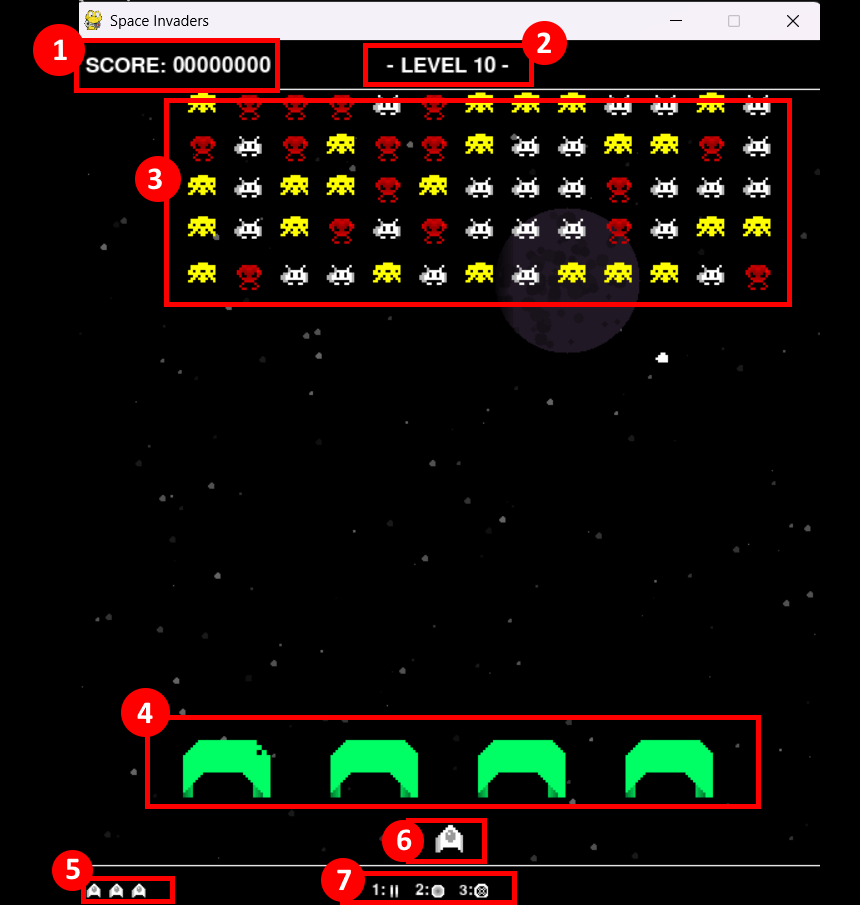
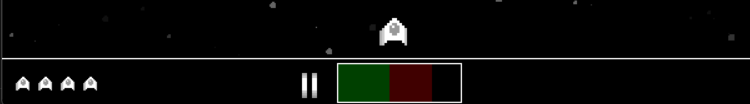

## 太空侵略者遊戲程式說明

### 執行方式  

#### 使用 PYTHON
1. 下載並安裝 PYTHON。
2. 下載本專案至電腦。
3. 開啟終端機，例如 *powershell* 或 *cmd* 或 *命令提示字元*。
4. 進入 `src` 目錄，執行 `pip install -r .\requments.txt`。
5. 執行 `.\main.py`，開始遊戲。

### 遊戲規則

#### 畫面介紹

1. 目前分數。
2. 目前關卡。
3. 敵機區域，擊毀所有敵機則通關。
4. 防護壁區域，可被敵我雙方子彈逐步打穿。
5. 我方殘機，所有殘機耗盡則遊戲結束。
6. 我方目前戰鬥中的飛機，被擊中後殘機扣一隻並重新復活。  
    復活後有短暫的無敵時間，不受敵人子彈的攻擊。

#### 操作說明  

1. 使用鍵盤方向鍵的左右鍵控制我方飛機的移動。
2. 使用鍵盤方向鍵的向上鍵、或空白鍵發射子彈。
3. 按下數字鍵 1、2、3 啟用不同的特殊能力：  
    1: 子彈威力加倍。  
    2: 開啟防護罩。  
    3: 凍結敵人。  

   > 關於能力的詳細說明請參閱 [特殊能力](#特殊能力) 一節。  
4. 按下鍵盤 `R` 鍵重啟遊戲，殘機數與累積分數都歸零重來。
5. 按住鍵盤的 `CTRL` 按鍵，並同時按下方向鍵的上、下鍵可選擇關卡。
6. 按 `F11` 或 `ALT+ENTER` 可切換全螢幕/視窗模式。

#### 過關條件   

擊毀畫面上所有敵機則過關。

#### 失敗條件

1. 遊戲一開始共有 5 架飛機，隻數顯示於下方狀態列。   
    每被敵方子彈擊中便減少一隻。  
    若用盡 5 隻飛機，則遊戲結束。  

2. 當敵方即將接近底線時，畫面上會開始出現閃爍的半透明紅色顯示範圍。任何一架敵機觸碰到此範圍則遊戲直接結束，無論剩下多少殘機。

#### 特殊能力

1. 遊戲中可啟用三種特殊能力，但同時間只能啟動一種。
2. 特殊能力啟用後，畫面下方的狀態列會出現兩種顏色的進度槽開始倒數：  
    綠色表示特殊能力的剩餘時間。  
    紅色表示啟動下一個特殊能力的冷卻時間。 

    

3. 特殊能力說明

    1.  **子彈威力加倍：**
        子彈威力與速度為原來兩倍，一擊能打掉敵人兩條命。  
        若第一擊打中的敵人只有一條命，則子彈會繼續打下一個敵人。  

    2.  **防護罩：**  
        開啟防護罩可保護我方飛機不受敵方子彈攻擊。  
        若防護罩在效果時間內被擊中三次便會失去效果，並須等待冷卻時間過後才能再次開啟防護罩。  

    3.  **凍結敵人：**  
        啟用此能力能短暫的凍結敵機以及敵方子彈的移動。趁敵方無法動彈時把握時間消滅敵機吧！

#### 敵方角色

敵方角色共有三種，主要是以生命的強韌度來區分。  
紅色敵人需要命中三次才能消滅 *(若子彈威力加倍則只需命中兩次)*。  
黃色敵人則需命中兩次才能消滅 *(若子彈威力加倍則只需命中一次)*。  
白色敵人只需命中一次即可消滅。  
